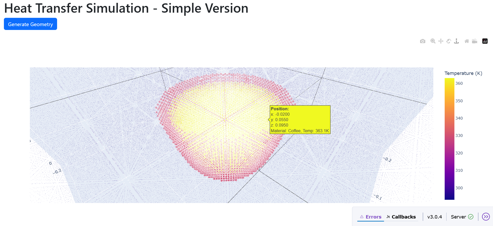
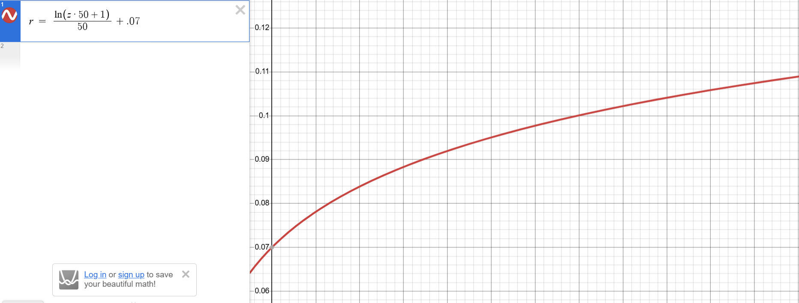

# Heat Transfer Simulation

A  heat transfer simulation using C++ with Python visualization to model the way heat dissipates from a coffee cup.

This is 3Blue1Browns playlist on the topic, focusing on Partial Differential Equations to solve the problem

https://youtube.com/playlist?list=PLZHQObOWTQDNPOjrT6KVlfJuKtYTftqH6&si=KGAH1tOJPqrnW8c0

## Features

- Point cloud-based heat transfer simulation
- C++ core for performance with Python bindings
- Interactive 3D visualization
- Real-time dashboard with parameter controls
- Dockerized environment for easy deployment

## Quick Start

### Using Docker (Recommended)

```bash
# clone the repository or open in a codespace and run

docker-compose up --build

```
visit your port 8050 and you should see this



### Here is the radius curve of the coffee cup r given by z



### To-Do

* At this point in the project I have changed it to Structure of Arrays, however I can still modify the code to fully take advantage of it
* I need to implement a neighbor system that works on initialization, not every step
* I need to tweak numbers for the actual step to examine the accuracy
* I want to generally trim down the code as well

* Longer Term: make the steps automatic, track time, pause the simulation, examine features about the current image
* Longer Term: handle convection or the way air takes away temperature, I want to experiment with air particles ticking more often, or being able to teleport or instantly transfer their temperature in a rising motion.

* Change the way variables work (with a config or data python file), allow user to set initial conditions

